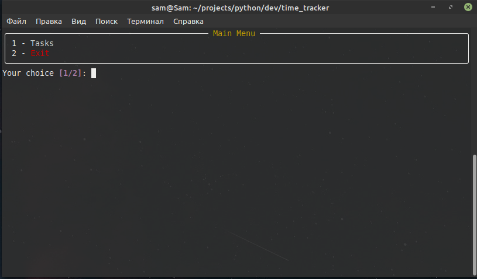
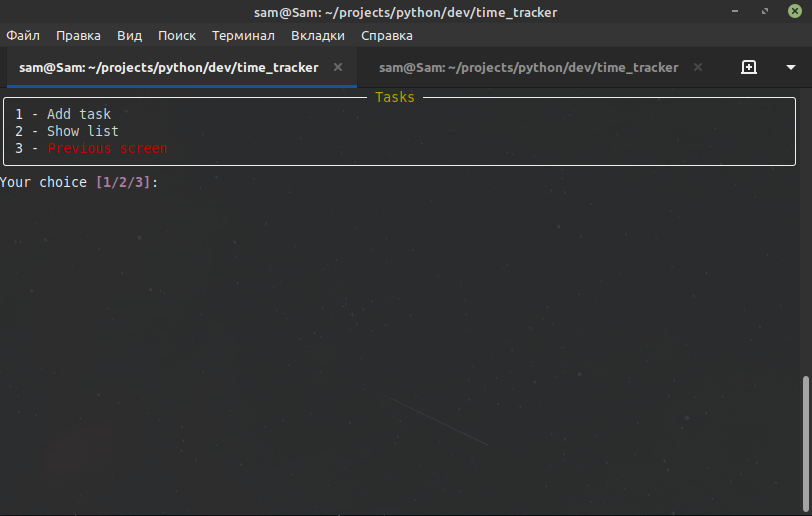
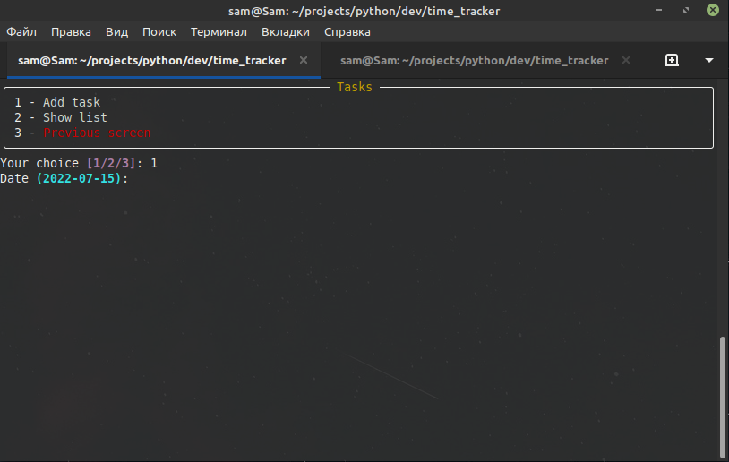
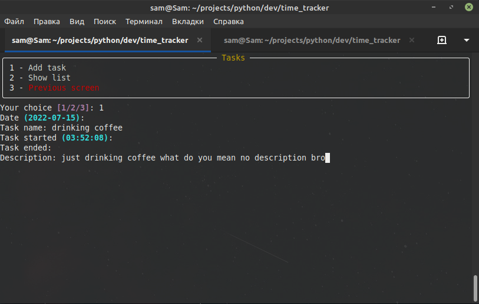
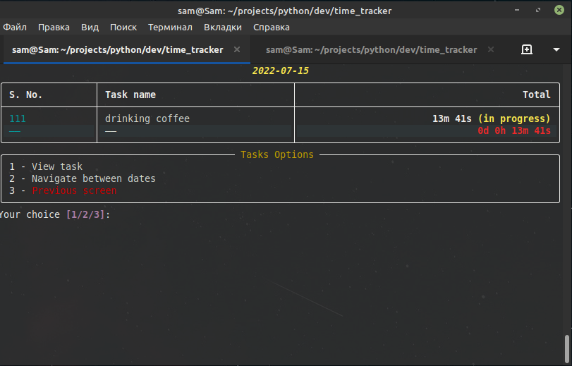
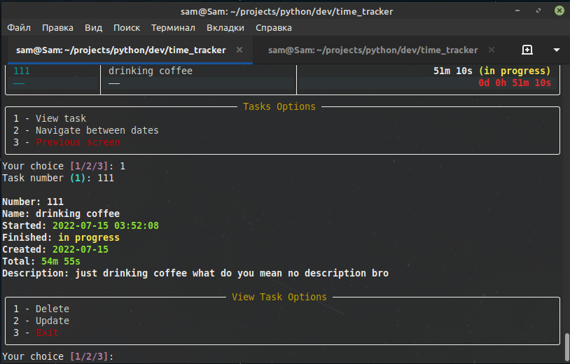
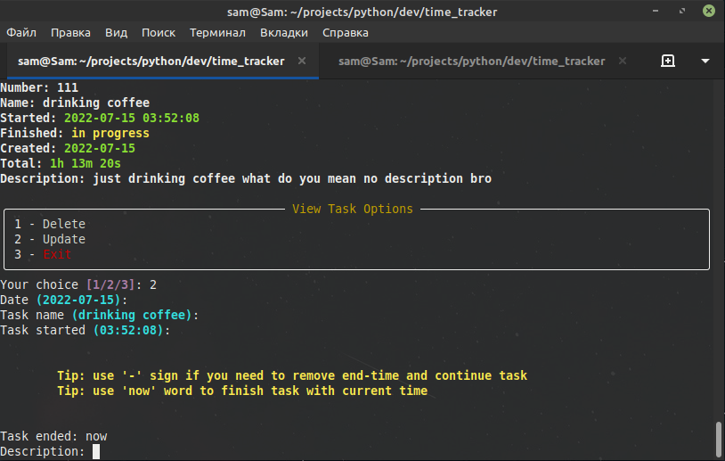
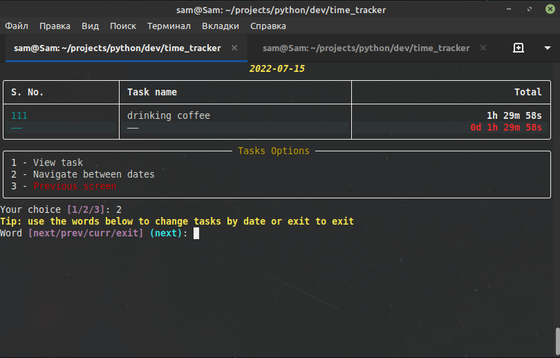

BOND
=================

BOND is a simple time tracker console application. It handles tasks creation,
editing, deleliton, showing and exporting.

Design Principles
=================

*  Have an extremely simple setup process with a minimal learning curve.
*  Create some tasks with their name, description, optionally start time and finish time
*  Watch them by manipulating simple menu or cli
*  Update, Delete, Finish, Continue or Filter by date
*  Export

Installation
=================

### Globally

    git clone https://github.com/SamFredrickson/Time-Tracker time_tracker

    cd time_tracker

    python setup.py install

### With virtual environment

    git clone https://github.com/SamFredrickson/Time-Tracker time_tracker

    cd time_tracker

    python -m venv venv 

    source venv/bin/activate

    python setup.py install

Usage
=================

The console application allows you to manipulate tasks in two ways:

1. Menu ``tracker menu``
2. Console commands ``tracker [command] [arguments]``

Use ``tracker --help`` to show availiable commands

Use ``tracker [command] --help`` to show help for specfic console command

### Menu

Menu is one of the ways to manipulate tasks, to start working with menu type ``tracker menu`` command.
You must see something like this:

1. Tasks - task actions (add, show)
2. Exit - leave menu

Let's see what's inside tasks

1. Add task - redirects us to another section of our menu where we create task
2. Show list - is a list of our tasks for today (by default)
3. Previous screen - immediately obvious our previous section

### Create first task

If you are in Tasks section just enter "1" and read carefully what to you need to know next.

You will be asked to input fields below consistently

1. Date (optional)
2. Task name (required)
3. Task started (required)
4. Task ended (optional)
5. Description (optional)

**WARNING! Cyan values in parentheses are default values and you dont need to enter values in parentheses again**

By default, Date is current day's date of your computer system. If you want to create a task for yesterday or for tomorrow you must enter this date in proper format (2022-02-02)

Task name is just a task name, enter short name. Example (drinking coffee)

By default, Task started is current time of your computer system. If you want to create a task with specific time you must enter this time in proper format (15:30:00)

Task ended is time you finish task, it's optional and you can leave it empty. In case you forgot to create a task you can enter time in proper format (03:00:00).

Description is optional and you can leave it empty.

So, our final result is:

After filling all fields and pressing "enter" key your task is created and menu is to it's initial state

### Watch your tasks

If you are in Tasks section just enter "2" (Show list).

You will be asked to input fields below consistently

1. Choose date from (required)
2. Choose date to (required)

By default, both fields are current day's date of your computer system. So, if you need to get a list of tasks for today just press enter twice quickly, that's it.

In case you want to get a list of tasks from 2022-02-02 to 2022-07-15 your fields must be filled this way:

**Choose date from (2022-07-15): 2022-02-02**

**Choose date from (2022-07-15): 2022-07-15**

Let's get our task for today by pressing "enter" key twice.

Well, we see our first task here that's still in progress.

In application exists only one status of task (in progress). In progress status indicates that task is running and time is ticking.

You if you see task with no in progress status it means task is not running and time is not ticking anymore.

**Task list structure**

Task list structure is quite simple.

1. Date
2. Table
3. Options

Date is chosen date in previous section (2022-07-15). If you chose date range (2022-02-02 to 2022-07-15) date would look differently (2022-02-02-2022-07-15)

Table consists of three columns:

1. Task Number
2. Task Name
3. Spent Time

Last row has red text on black background and shows total spent time of all tasks.

Tasks options:

There's tasks options under table.

1. View task
2. Navigate between dates
3. Previous screen

**View task**

If you are in list of tasks section enter "1" (View Task).

You will be asked to fill task id.

1. Task number (required)

By default, task number is 1. In our case task number is 111.
If your task exists you get complete descritpion and new options.

**View tasks options**

1. Delete
2. Update
3. Exit or previous screen

**Delete**

If you choose to delete task you will run into a prompt:

Task: "task number" - "task name"

Are you sure? [y/n]:

Enter y to delete

Enter n to leave

**Update**

Update is one the ways to stop or continue task.

If you choose to update task you will be asked to fill fields:

1. Date (optional)
2. Task name (optional)
3. Task started (optional)
4. Task ended (optional)
5. Description (optional)

All fields are optional because they're already filled.

Let's look at the final result:

During updating you can see these two tips on the screen

In my case task is running and i dont have task ended value by default, so i choose "now" to finish task with current system time. 

If you wish you can enter time in proper format (15:00:00) instead of "now" or "-".

**Navigating between dates**

Dates navigation is option in task list menu that allows you to change list with new date

Avialables options in navigiation mode:

1. Next - gets a list with a next date
2. Prev - gets a list with a previous date
3. Curr - gets a list with a current date
4. Exit

After getting a list with date you need type "exit".

Authors
=======

BOND was created by `Sam Fredrickson <https://github.com/samFredrickson/>`